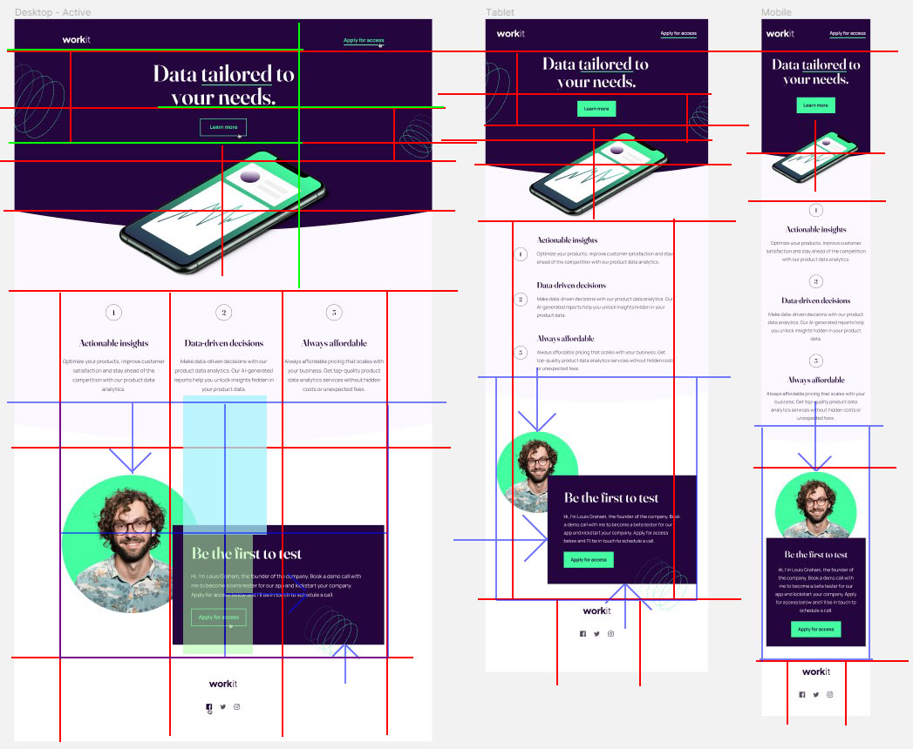

# Frontend Mentor - Workit landing page solution

A solution provided by jefflangtech [Workit landing page challenge on Frontend Mentor](https://www.frontendmentor.io/challenges/workit-landing-page-2fYnyle5lu). 

## Table of contents

- [Overview](#overview)
  - [The challenge](#the-challenge)
  - [Screenshot](#screenshot)
  - [Links](#links)
- [My process](#my-process)
  - [Built with](#built-with)
  - [Step by step](#step-by-step)
  - [Continued development](#continued-development)
  - [Useful resources](#useful-resources)
- [Author](#author)

## Overview

### The challenge

Users should be able to:

- View the optimal layout for the interface depending on their device's screen size
- See hover and focus states for all interactive elements on the page

### Screenshot

### Links

- Solution URL: [https://www.frontendmentor.io/solutions/workit-landing-page-with-html-and-css-XVftN7fkmS](https://www.frontendmentor.io/solutions/workit-landing-page-with-html-and-css-XVftN7fkmS)
- Live Site URL: [https://jefflangtech.github.io/workit/index.html](https://jefflangtech.github.io/workit/index.html)

## My process

### Built with

- Semantic HTML5 markup
- CSS custom properties
- Flexbox

### Step by step

This is the first project where I am really coming back to the basics in order to improve my system of coding overall. 

Here is how it went:
- Set up the design system (1:04)
- Markup the layout (0:50)

Based on my layout sketch I *think* that I'll be creating this page like so:
1. Top nav simple in flex (it doesn't need flex but a more complex nav would)
2. Header-hero section with 3 divs where the SVG components are transformed in position or scale. Thinking I can do this with relative positioning but not entirely sure. The curved border edge I will have to look up how to do
3. Pretty simple grid section for the 1-2-3 parts
4. The "owner headshot" and "Be the first to test" parts actually look fun to implement and I'm thinking that they will be transforms adjusted for media layouts. It looks like each is sized to fit in its own block but is then moved. I'm trying that first
5. Footer again super easy with some centered logos/links

- Readme/notes/plan update (0:20)
- Nav and some media queries (1:02)
  - I was hoping to get the inline padding to shrink in a linear fashion as the screen decreased in size but discovered that the CSS calc function is not that capable...yet
- Header for desktop (2:04)
  - Holy heck getting the curved of that bottom edge, along with the overflow content, was a lot more than I was anticipating. Had to spend a good chunk of time looking up how to implement, using GPT, and finally settled on a clip-path on an absolute position div under the phone image that was then clipped with an ellipse shape
- Media queries for the header, I forgot about these (0:49)
- 1 2 3 text content section which I used flexbox for, regretted not using grid, realized grid wouldn't solve all the problems, stuck with flexbox, still not sure (1:48)
  - I was surprised by another very light background with curved section that I missed probably because my monitors don't have great contrast. Whoops.
- Founder section, closest I've gotten to my time estimate so far (0:56)
- No unexpected surprises on the footer and only had to embed the SVG icons in the HTML so I could manipulate the color on hover (0:20)
- Final validation checks and CSS optimization/organization (0:27)

Total time: 9:45

### Continued development

Obviously I need to work on my time estimates. This is the first time I've tried it so abject failure was expected. Primarily I'm wayyyy underestimating how long it will take me to implement things.

The other aspect I will be looking more closely at for the next project is working on solutions to problems before I'm in the thick of implementing the layout. I honestly don't know if others do that down to the last detail, and for some things I really do just wing it and address at the time it comes up, so I'll be doing some research as well to see what best practices exist.

### Useful resources

- [MDN](https://developer.mozilla.org/en-US/docs/Web/CSS/clip-path) - Creating an ellipse shape that was layered under another div is how I implemented the curves. MDN, as always, helped me to understand how it works...kinda.

## Author

- Website - [JeffLangTech](https://jefflangtech.github.io/)
- Frontend Mentor - [@jefflangtech](https://www.frontendmentor.io/profile/jefflangtech)